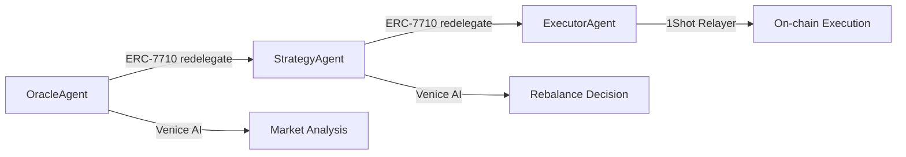

# PortfolioAI — Autonomous DeFi Portfolio Agent

> **Award-Winning Architecture**: MetaMask Smart Accounts Kit × Venice AI × 1Shot Relayer  
> **Hackathon Targets**: Best Agent ($3k) · Best A2A Coordination ($3k) · Best Venice AI ($3k) · Best 1Shot ($1k)


## 🏗️ What This Does

**PortfolioAI** is an autonomous DeFi portfolio management system that:
- Upgrades your MetaMask EOA to a Smart Account (EIP-7702)
- Grants **one-time permission** for autonomous rebalancing (ERC-7715)  
- Runs a **3-agent pipeline** that monitors, reasons, and rebalances your portfolio
- Uses **Venice AI** for market analysis and decision-making
- Executes swaps **gaslessly** via 1Shot Relayer (gas paid in USDC)
- Provides **real-time UI** with transaction status and agent activity

### Agent Pipeline



1. **OracleAgent**: Fetches prices, generates Venice AI market summary
2. **StrategyAgent**: Venice AI reasoning about portfolio drift and rebalancing
3. **ExecutorAgent**: Executes swaps via 1Shot Permissionless Relayer

## 🚀 Quick Start

### Prerequisites
- Node.js 18+
- MetaMask browser extension
- Venice AI API key
- Base Sepolia ETH for initial setup

### Installation

```bash
# Clone and install dependencies
git clone https://github.com/your-username/portfolioai.git
cd portfolioai
npm install

# Configure environment
cp .env.local.example .env.local
# Edit .env.local with your Venice AI key and other settings

# Run development server
npm run dev
```

### Environment Setup

Get your Venice AI API key from [https://venice.ai](https://venice.ai) and add to `.env.local`:

```env
VENICE_API_KEY=your_venice_api_key_here
NEXT_PUBLIC_CHAIN_ID=84532
NEXT_PUBLIC_RPC_URL=https://sepolia.base.org
NEXT_PUBLIC_USDC_ADDRESS=0x036CbD53842c5426634e7929541eC2318f3dCF7e
```

For webhook testing (optional):
```bash
# Expose local webhook endpoint
npx ngrok http 3000
# Add ngrok URL to .env.local
WEBHOOK_BASE_URL=https://your-ngrok-url.ngrok.io
```

## 🏛️ Architecture Deep Dive

### Smart Account Upgrade (EIP-7702)
```typescript
// User connects MetaMask → Smart Account upgrade via 1Shot
const smartAccount = await getOrCreateSmartAccount(window.ethereum)
```

### Permission Grant (ERC-7715)  
```typescript
// One-time approval for autonomous rebalancing
const permission = await requestRebalancePermission(
  window.ethereum, 
  oracleAgentAddress, 
  200 // Max $200 USDC weekly
)
```

### Agent Delegation Chain (ERC-7710)
```typescript
// Root delegation: User → OracleAgent
const root = await createRootDelegation(smartAccount, oracleAgent)

// Redelegation: OracleAgent → StrategyAgent → ExecutorAgent
const strategy = await redelegateToAgent(root, strategyAgent)
const executor = await redelegateToAgent(strategy, executorAgent)
```

### Venice AI Integration
```typescript
// Market analysis
const summary = await veniceChat(
  "You are a DeFi market analyst...",
  `Current prices: ETH $3200, BTC $45000...`
)

// Rebalance reasoning  
const decision = await reasonRebalance(prices, allocations, targets)

// Portfolio visualization
const chartUrl = await veniceGenerateChart(allocations)
```

### 1Shot Gasless Execution
```typescript
// Submit transaction with USDC gas payment
const relay = await relayDelegationRedemption(relayerId, {
  calls: [{ to: uniswapRouter, data: swapCalldata }],
  delegation: executorDelegation,
  gasToken: usdcAddress,
  webhookUrl: '/api/webhook/1shot'
})
```

## 📊 Features

- **🔐 One-Time Setup**: Grant permission once, agents run autonomously
- **🤖 Multi-Agent System**: Specialized agents for data, strategy, and execution  
- **🧠 AI-Powered**: Venice AI market analysis and rebalancing decisions
- **⚡ Gasless**: 1Shot Relayer pays gas in USDC, no ETH needed
- **📈 Real-time UI**: Live portfolio tracking, agent activity, and transaction status
- **🎨 Visual Charts**: Venice AI-generated portfolio pie charts
- **🔔 Webhook Integration**: Real-time transaction status updates

## 🛠️ Development

### Project Structure

```
├── app/
│   ├── api/agent/          # Agent pipeline endpoints
│   │   ├── oracle/         # Market data + Venice analysis
│   │   ├── strategy/       # Rebalance decision logic  
│   │   ├── execute/        # 1Shot transaction execution
│   │   └── run/            # Orchestrate full pipeline
│   ├── dashboard/          # Main portfolio UI
│   └── page.tsx            # Landing/connection page
├── lib/
│   ├── metamask.ts         # Smart Accounts Kit integration
│   ├── venice.ts           # Venice AI client
│   ├── oneshot.ts          # 1Shot Relayer client
│   └── store.ts            # In-memory state management
└── components/             # React UI components
```

### Key API Endpoints

| Endpoint | Method | Description |
|----------|--------|-------------|
| `/api/agent/oracle` | GET | Fetch prices, Venice market summary |
| `/api/agent/strategy` | POST | Venice reasoning, ERC-7710 redelegation |
| `/api/agent/execute` | POST | Execute swaps via 1Shot relayer |
| `/api/agent/run` | POST | Run full 3-agent pipeline |
| `/api/webhook/1shot` | POST | Receive transaction status updates |
| `/api/state` | GET/POST | Manage application state |

### Testing

```bash
# Type checking
npm run typecheck

# Linting  
npm run lint

# Build
npm run build
```

## 🎯 Hackathon Compliance

### ✅ MetaMask Smart Accounts Kit
- [x] `createMetaMaskSmartAccount` for EIP-7702 upgrades
- [x] ERC-7715 Advanced Permission (one-time approval)
- [x] ERC-7710 A2A delegation chain (3-agent redelegation)

### ✅ Venice AI Integration  
- [x] Text completions for market analysis
- [x] Decision-making and reasoning
- [x] Image generation for portfolio charts
- [x] Real-time AI-powered rebalancing

### ✅ 1Shot Permissionless Relayer
- [x] Gasless execution (USDC gas payment)
- [x] EIP-7702 EOA upgrades  
- [x] Webhook integration for real-time status
- [x] No API key required

### ✅ Agent-to-Agent Coordination
- [x] Multi-agent pipeline with clear delegation
- [x] ERC-7710 redelegation chain
- [x] Autonomous decision-making workflow
- [x] Real-time agent activity monitoring

## 🔧 Configuration

### Environment Variables

| Variable | Required | Description |
|----------|----------|-------------|
| `VENICE_API_KEY` | ✅ | Venice AI API key |
| `NEXT_PUBLIC_CHAIN_ID` | ✅ | Network ID (84532 = Base Sepolia) |
| `NEXT_PUBLIC_RPC_URL` | ✅ | Base Sepolia RPC endpoint |
| `NEXT_PUBLIC_USDC_ADDRESS` | ✅ | USDC token contract address |
| `WEBHOOK_BASE_URL` | ⚠️ | Ngrok URL for webhook testing |
| `WEBHOOK_SECRET` | ⚠️ | HMAC secret for webhook security |
| `NEXT_PUBLIC_USE_MOCK_PRICE_FEED` | 🔧 | Enable mock data for development |

### Network Configuration

**Base Sepolia Testnet**:
- Chain ID: `84532`
- RPC: `https://sepolia.base.org`  
- USDC: `0x036CbD53842c5426634e7929541eC2318f3dCF7e`
- Block Explorer: [https://sepolia.basescan.org](https://sepolia.basescan.org)

## 🚨 Production Considerations

This is a hackathon prototype. For production use:

- [ ] Replace in-memory store with Redis/database
- [ ] Implement proper agent smart contracts  
- [ ] Add comprehensive error handling
- [ ] Implement slippage protection
- [ ] Add multi-token support beyond ETH/USDC
- [ ] Implement proper access controls
- [ ] Add comprehensive testing suite
- [ ] Security audit of delegation logic

## 🏆 Awards Targeting

- **🏅 Best Agent** ($3k): Multi-agent autonomous portfolio management
- **🔗 Best A2A Coordination** ($3k): ERC-7710 redelegation pipeline  
- **🎨 Best Venice AI** ($3k): Market analysis, reasoning, and chart generation
- **⚡ Best 1Shot** ($1k): Gasless execution and EIP-7702 upgrades

## 📝 License

MIT License - see [LICENSE](LICENSE) file for details.

---

*Built with ❤️ for the DeFi hackathon. Showcasing the future of autonomous portfolio management.*